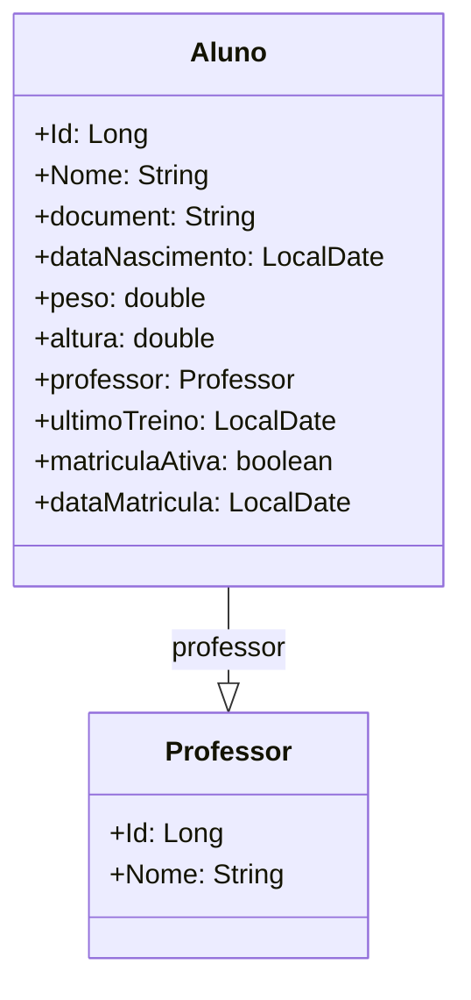

# Academia
Um projeto para praticar Java Spring, utilizando Banco de Dados Postgres e aplicação upada na nuvem atráves do Railway.
## Diagrama de Classes

## Link para a aplicação
A aplicação está disponivel para testes no link: https://academia-production.up.railway.app/swagger-ui/index.html
Ainda não está totalmente pronta, devo adicionar alguns metodos e quero ainda adicionar um Handler para exceções e talvez mais pra frente com mais conhecimento adicionar o controle de rotas para finalizar a aplicação, porém é uma base do projeto que já funciona de forma bem integrada com o banco de dados.

## Dependencias utilizadas na API
* Spring JPA
* Spring H2(Apenas no ambiente de Testes)
* Spring Postgres
* Spring Swagger(Para o design da pagina onde fazem as requisições)

## Informações importantes
O Aluno só pode ser cadastrado se um professor for cadastrado na camada abaixo, afinal de contas, se um professor não existe não tem como o aluno existir.
